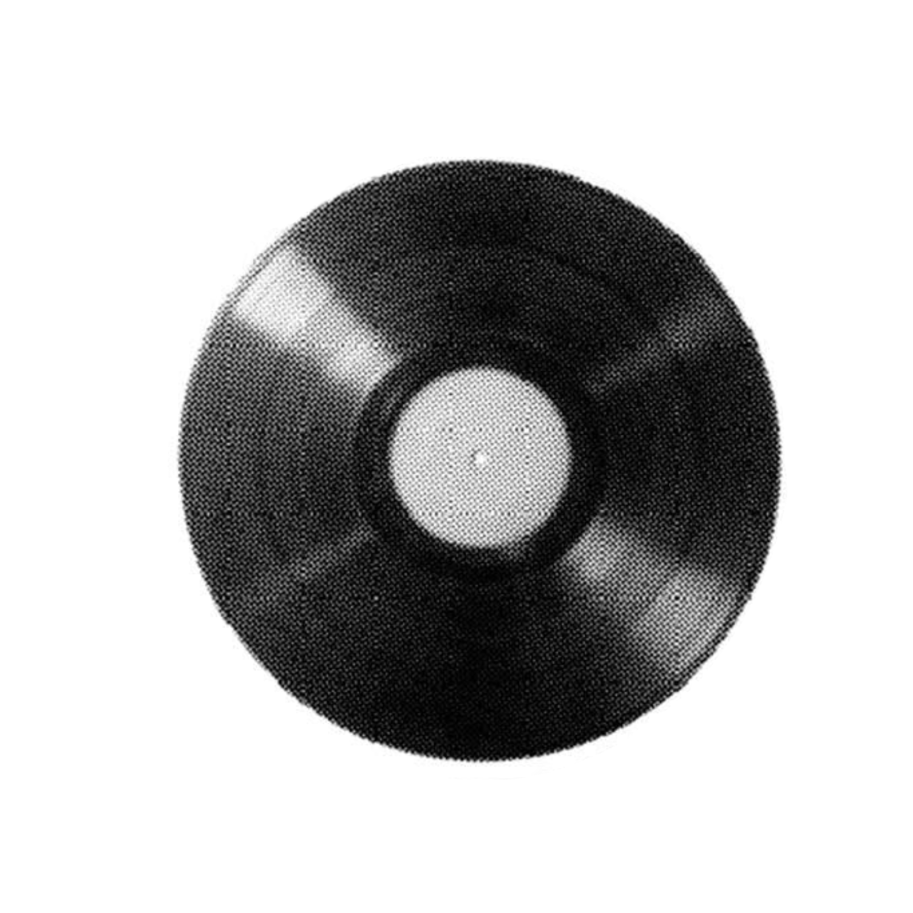
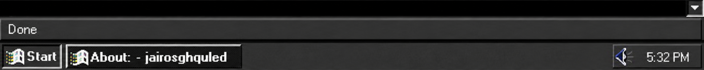
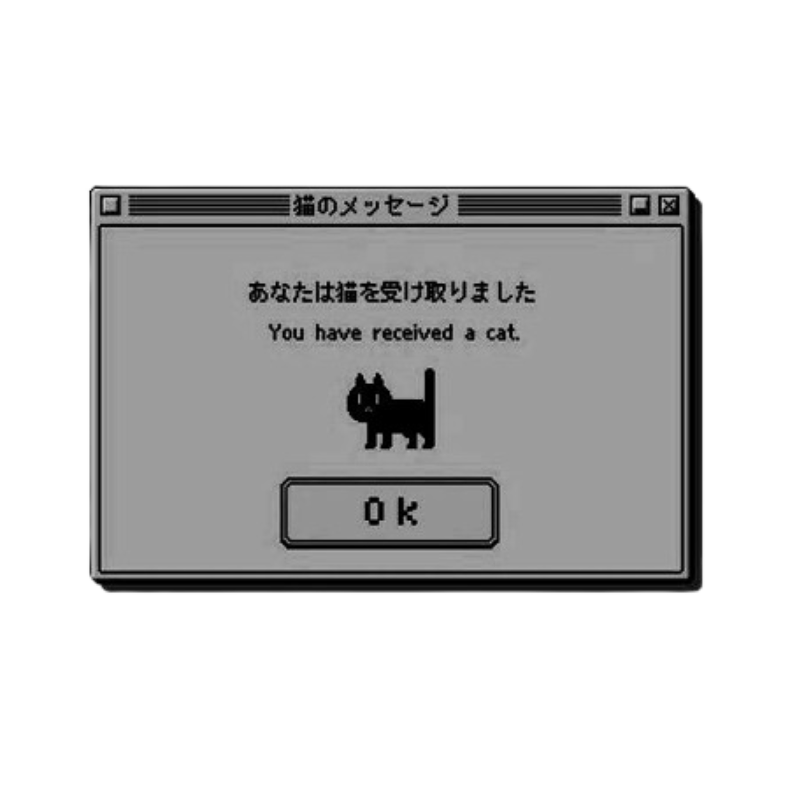

<h2 align="center">†⸸     know about me</h2>

  

  okay lets do this one more time yeah? yo, im jai or jairo, also known as lovednotes. im 16-year-old self-studying ICT to become a scripter. im the proud owner of the Nishikiyama-gumi, a PonyTown yakuza clan. i make animations, read manga, write, and learn japanese in my free time. im determined to build a life of my own despite coming from a harsh past. my favorite color is dusty blue.

金は好意を買う。忠誠は信頼を得る。

 

<h3 align="right">†⸸     僕はグールだ。死が僕を取り巻いている。それが僕という存在なんだ。</h3>

<table width="100%">
<tr>
<td width="50%" valign="top">

 

i tend to leave people on read and is mostly an avoidant from people. i need tonetags sometimes. i have suspected a [cluster-b disorder](https://my.clevelandclinic.org/health/diseases/cluster-b-personality-disorders), primarily [BPD](https://www.mayoclinic.org/diseases-conditions/borderline-personality-disorder/symptoms-causes/syc-20370237) and [NPD](https://www.mayoclinic.org/diseases-conditions/narcissistic-personality-disorder/symptoms-causes/syc-20366662). i usually treat people with the same respect they give me. sometimes i can be caught up within my own head and disregard others without intending to.

</td>

<td width="50%" valign="top">

 

placeholder

</td>
</tr>
</table>

<h3 align="left">†⸸     my projects — プロジェクト</h3>

   
  incxherents is a server for fun, friendship, and bringing people together!
  <em>Meet others who enjoy art, gaming, chatting, and more! You can earn Nitro, Robux, and more by multiple methods in my server. (currently not maintained.)</em>

   
  Work in progress. Early in development; invites are open to staff applicants only.
  <em>The Nishikiyama-gumi, a subsidiary of the Enomoto-ikka, is a Japanese yakuza regiment based on the Roblox Ro-Mob clan. Reimagined in PonyTown to offer an complex, immersive experience.</em>

 
