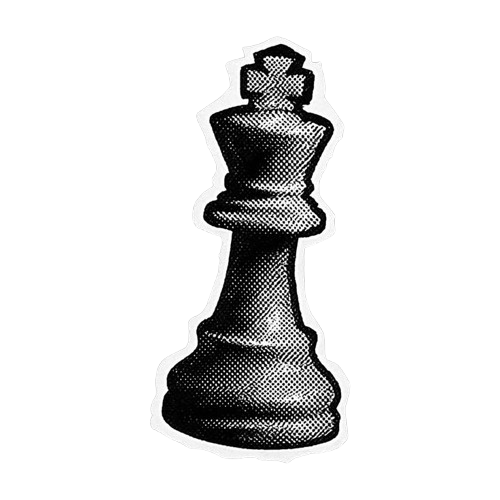

<h2 align="center">†⸸     know about me</h2>

  

  okay lets do this one more time yeah? yo, im jai or jairo, also known as lovednotes. im 16-year-old self-studying ICT to become a scripter. im the proud owner of the Nishikiyama-gumi, a PonyTown yakuza clan. i make animations, read manga, write, and learn japanese in my free time. im determined to build a life of my own despite coming from a harsh past. my favorite color is dusty blue. my aesthetic is dark acubi/dark grunge.

金は好意を買う。忠誠は信頼を得る。

 

<h3 align="right">†⸸     僕はグールだ。死が僕を取り巻いている。それが僕という存在なんだ。</h3>

<table width="100%">
<tr>
<td width="50%" valign="top">

 

i tend to leave people on read and mostly an avoidant-attachment when it comes to people. i need tonetags sometimes. i have a <strong>suspected</strong> [cluster-b disorder](https://my.clevelandclinic.org/health/diseases/cluster-b-personality-disorders), primarily [BPD](https://www.mayoclinic.org/diseases-conditions/borderline-personality-disorder/symptoms-causes/syc-20370237) and [NPD](https://www.mayoclinic.org/diseases-conditions/narcissistic-personality-disorder/symptoms-causes/syc-20366662). i usually treat people with the same respect they give me. sometimes i can be caught up within my own head and disregard others without intending to. on the rare occasion, i make kms jokes but never kys jokes. (ex. ima end it, jumps off bridge, etc.)

</td>

<td width="50%" valign="top">

 

basic dni criteria: heavily religious, is/used to be staff in DDS (Deep Dive Seals) or DSS (Deep Sea Seals) or support them, ableist, racist, homophobic, etc., if ur gonna tell me to boost your content if we aren't close, BELOW 13 or OVER 21, fujoshis/fudanshi/fujins, people that know me irl, ai "artists", darkshippers, ageplayers (age regressors are fine)

</td>
</tr>
</table>

<h3 align="left">†⸸     君に興味があるかって？　とんでもない！</h3>

  

  
  </a> 
  reading, writing, scripting, manga, poetry, ponytown, roblox, minecraft, jaa kimi no kawari ni korosu ka, sk8 the infinity, banana fish, death note, phantom busters, stranger by the shore, music, jiinzo, whatsaheart, i'm geist, snave, desire4u, noturtype, worlds end, mourn, insane clown posse, ayesha erotica, shoegaze, gacha, animating, editing, world zero, sam and colby, adopt me

  
  </a> 
  my mother, fried chicken, fish, people, strong smells, idfk tbh

 

<h3 align="center">†⸸     connect to me!</h3>

 

「Shadows - jairosghquled」 — 9:22 – 9:30 PM · Sat, May 2, 2026

 

時々、憎んでしまう  
なれたはずの自分を。  
青白い手が鏡を引っ掻き、  
中へ入れてくれと懇願する  

今の自分という影に溺れている。  
後悔で縫い合わされた屍のように、  
借り物の闇を吸い込みながら  

名前は灰の味がして、  
映るはずの姿は留まらない。  
自分の亡霊でさえも  
今の自分に怯えている。

<h3 align="left">†⸸     my projects — プロジェクト</h3>

   
  incxherents is a server for fun, friendship, and bringing people together!
  <em>Meet others who enjoy art, gaming, chatting, and more! You can earn Nitro, Robux, and more by multiple methods in my server. (currently not maintained.)</em>

   
  Work in progress. Early in development; invites are open to staff applicants only.
  <em>The Nishikiyama-gumi, a subsidiary of the Enomoto-ikka, is a Japanese yakuza regiment based on the Roblox Ro-Mob clan. Reimagined in PonyTown to offer a complex, immersive experience.</em>

 

<h2 align="center">†⸸     contribution — 寄稿</h3>

  

